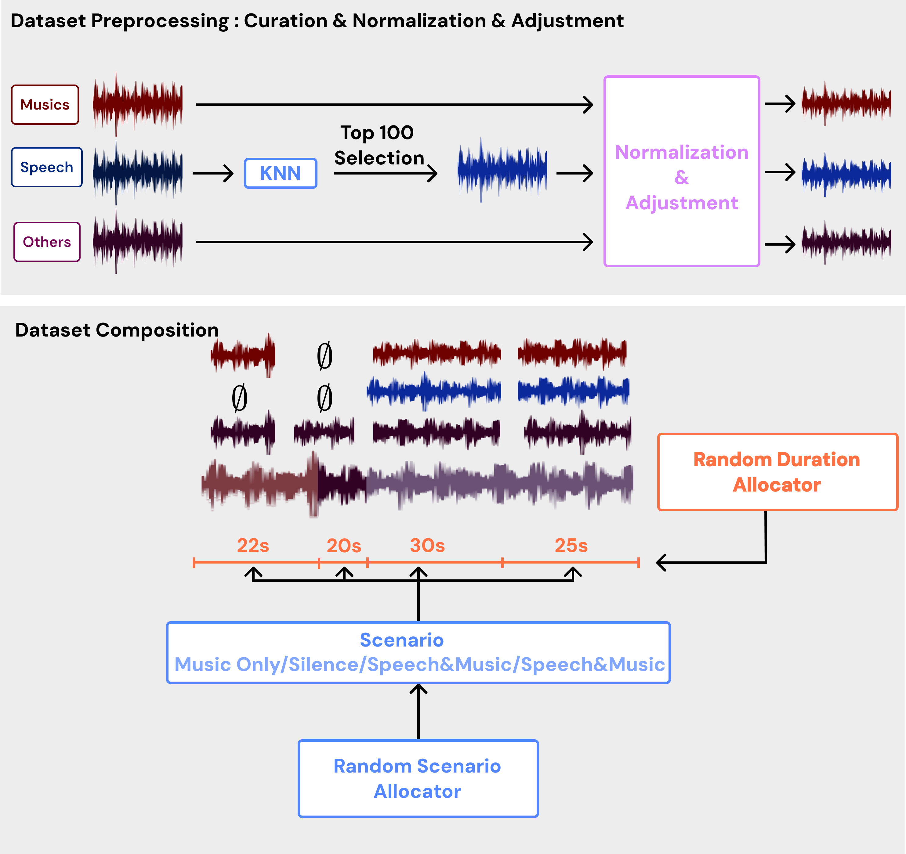
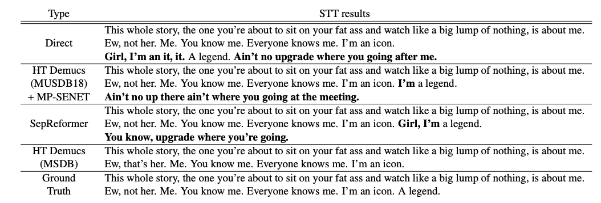

# MediaSeparationDataBase
This repository provides the dataset designed for training music source separation models on real-world media content. 
The dataset integrates multiple audio sources, enabling advanced processing for speech and music separation.

[Paper](https://drive.google.com/file/d/1maNvkurRR2gw0laRt_-mgCgiekVCLWhF/view?usp=share_link)

## Quick Start
Run the following command to generate the dataset using the default configuration:  

```
 python3 gen_dataset.py --config config.yaml
```

## Overview of Dataset Generation
The dataset is constructed through a multi-step process, as illustrated below:


## STT Result for Media Source Separation
The following visualization highlights the Speech-to-Text (STT) evaluation results on [Whisper-turbo](https://huggingface.co/openai/whisper-large-v3-turbo), demonstrating the effectiveness of our approach:


## Demonstration
We provide a demonstration of separation results produced by [HT Demucs](https://github.com/facebookresearch/demucs) trained on this dataset.
Also, as a baseline, we provide the separation results produced by [SepReformer](https://github.com/dmlguq456/SepReformer) and HT Demucs trained on MUSDB18.
### Sample 1 : XO, Kitty, Season 1 Chapter 1, Netflix, Timestamp: 28m ~ 28m 14s
- [Original Source](https://drive.google.com/file/d/1NBfCYshEqUbPuzqC8xNdnbNeQDj1-b06/view?usp=share_link) 
- [SepReformer](https://drive.google.com/file/d/18BKCgBjnK0cPLMzY8_f-adbjp3zVFZOK/view?usp=share_link) 
- [HT Demucs (MUSDB18)](https://drive.google.com/file/d/1HA4zj8_Du6w1YB12RPZmL10mAgPMTyC-/view?usp=share_link) 
- [HT Demucs (MSDB)](https://drive.google.com/file/d/1nfmsudeqOPfrdIrilCejjGyOg1A1poSa/view?usp=share_link)

### Sample 2 : Gossip Girl, Chapter 1, Netflix, Timestamp: 1m ~ 1m 52 s
- [Original Source](https://drive.google.com/file/d/1Jkoyw3S12OaIDwBUL2gYpRjzsOT0t-JG/view?usp=share_link) 
- [SepReformer](https://drive.google.com/file/d/1ibWwxcFJBVc3KINMYBgcpWwizynN35QE/view?usp=share_link) 
- [HT Demucs (MUSDB18)](https://drive.google.com/file/d/1Z1hU0tQNZW_nbxmwEBMZ0p-2twt-IbNF/view?usp=share_link) 
- [HT Demucs (MSDB)](https://drive.google.com/file/d/1rLgZtINpRQTd8RUM6K0Uxh2VHyY_GDs7/view?usp=share_link)

## Workspace Structure
The following directory structure outlines the organization of raw and processed data:
```
##common_voice_17_0
##musdb.train
##musan.noise.sound-bible

data/
├── cv-corpus-17-curated         # Common Voice curated dataset
│   ├── common_voice_curated_train
│   │   ├── common_voice_en_12345.wav
│   │   ├── common_voice_en_67890.wav
│   │   └── ...
│   └── common_voice_curated_test
│       ├── common_voice_en_2737.wav
│       ├── common_voice_en_71783.wav
│       └── ...
├── musdb                       # Music stem dataset
│   ├── train
│   │   ├── music-001.stem.mp4
│   │   ├── music-002.stem.mp4
│   │   └── ...
│   └── test
│       ├── music-003.stem.mp4
│       ├── music-004.stem.mp4
│       └── ...
└── musan                       # Noise dataset
    ├── music                   # Not used here
    │   ├── music-001.wav
    │   ├── music-002.wav
    │   └── ...
    ├── noise                   # Background noise sound dataset
    │   ├── free-sound          # Free Sound source
    │   │   ├── noise-sound-001.wav
    │   │   ├── noise-sound-002.wav
    │   │   └── ...
    │   └── sound-bible         # Sound Bible source
    │       ├── noise-sound-bible-0071.wav
    │       ├── noise-sound-bible-0072.wav
    │       └── ...
    └── speech                  # Not used here
        ├── speech-001.wav
        ├── speech-002.wav
        └── ...

```

## Example of Dataset Generated
The processed dataset is organized as follows:
```

processed_data_curated/
├── train/
│   ├── Actions - Devil's Words_mix.wav
│   ├── Actions - Devil's Words_music.wav
│   ├── Actions - Devil's Words_speech.wav
│   ├── Actions - Devil's Words_others.wav
│   ├── ...
├── validation/
│   ├── AvaLuna - Waterduct_mix.wav
│   ├── AvaLuna - Waterduct_music.wav
│   ├── AvaLuna - Waterduct_speech.wav
│   ├── AvaLuna - Waterduct_others.wav
│   ├── ...
├── test/
│   ├── Arise - Run Run Run_mix.wav
│   ├── Arise - Run Run Run_music.wav
│   ├── Arise - Run Run Run_speech.wav
│   ├── Arise - Run Run Run_others.wav
│   ├── ...
├── train.csv
├── validation.csv
└── test.csv

## Following our dataset is created with the parameters from the config.yaml above.

```

## Download Datasets

- [Download MUSDB](https://drive.google.com/file/d/15QMdtI17JFjKzPLIVEMZDBJMJef7PJsx/view?usp=sharing)
- [Download MUSAN Noise](https://drive.google.com/file/d/1r-rqnSzligtNrYloBX4hCl7lkCR12ZQ1/view?usp=sharing)
- [Download our preprocessed curated Dataset](https://drive.google.com/file/d/1E2tcYXM7e3HgUGVa7oH2ntoG0-VcQR9o/view?usp=sharing)

## Citation
If you use this dataset in your work, please cite as follows:
```
@misc{lee2024towards,
  title        = {TOWARDS REAL-WORLD MEDIA SEPARATION: ENHANCING MUSDB18 WITH OPEN-SOURCE SPEECH DATA FOR SPEECH AND MUSIC PROCESSING},
  author       = {Jung Min Lee and Su Min Park},
  year         = {2024},
  note         = {*Equal contribution},
  howpublished = {\url{https://github.com/jmSNU/MediaSeparataionDatabase.git}},
}
```

## Acknowledgements

- Our dataset is built using the following sources:
  - [Common Voice v17.0](https://commonvoice.mozilla.org/en/datasets)
  - [MUSDB18](https://sigsep.github.io/datasets/musdb.html)
  - [MUSAN](http://www.openslr.org/17/)

- [2024.12.19] Thanks to the contributors of these datasets for providing valuable resources for audio processing research.
